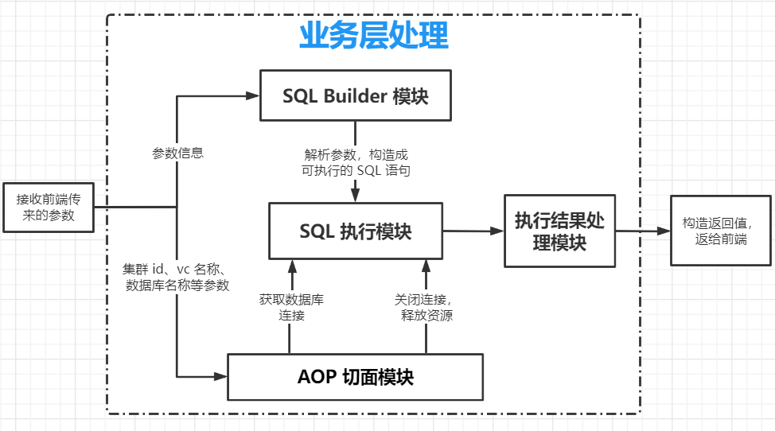
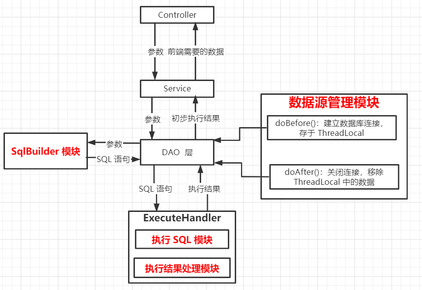

## 项目背景

阐述项目的背景以及需求：在某 Web 项目中集成一个功能模块，就是提供基于 `B-S` 结构的可以对数据库、表、视图、存储过程、表数据等进行可视化操作。与我之前参与的一个项目 DMS（Data Manage System）很是相似。这是在已有项目中进行集成，直接点就是在旧有项目上添加一个菜单，点击菜单打开这一大块库表等操作。

对于前端实现，与项目已有功能保持一致，继续使用 `Jquery` 版本的 `EasyUI` 框架。鉴于库表的前端展示具有层级结构，后引入 `ZTree.js` 来作树形菜单。本文的重点是后端设计，前端啰嗦这么几句够了。

## 后端设计

### 动手前的一些思考

熟悉了需求，思考了很多。最终总结出项目大致的操作流程，只说最重要的步骤，类似于参数校验等先行略过。

- 前端页面可视化的点击操作，把表格或表单的数据传给后端；
- 后端解析数据，比如创建表功能，前端传来一大坨表单数据，后端首先要解析数据，并且构建成一条类似于 `create table xxx` 的 SQL 语句；
- 创建数据库连接；
- 执行第二条构建出来的 SQL 语句；
- 获取执行结果；
- 关闭数据库连接；
- 处理执行结果，构造成前端需要的数据，返给前端。

确定了整个操作流程，便开始后端设计。有两个问题，如下：

第一个问题，连接关闭数据库、执行 SQL 语句肯定会有很多通用性代码，而这里也不适合使用 ORM 框架，毕竟没有业务实体类来跟某表做映射。

第二个问题，库的增删查操作、表的增删改查、视图的增删查等等，所有的操作几乎都被框在了上文的操作流程之中，即所有的功能实现均符合上述流程。

鉴于上述第一个问题，最终决定使用原生 JDBC 进行操作。对于第二个问题，就需要进行系统设计来简化通用代码，提升系统稳定性与可操作性，同时具有一定的扩展性。于是我做了如下的设计。

### 总体设计

按照通用的操作流程划分不同的模块，各个模块组合实现预期功能。具体模块如下：

- `SQL Builder 模块`：解析前端传来的参数，构造出预期可执行的 SQL 语句；
- `SQL 执行模块`：就是直接执行 SQL 语句，通用的执行模块大大减少了 JDBC 执行 SQL 语句的样板性代码；
- `执行结果处理模块`：按不同的返回值类型，返回不同的结果；
- `数据源管理模块`：使用 AOP 技术来管理数据源的连接与释放，大大简化了数据库连接与释放的通用性代码。

下面粘一张当时设计时画得**模块划分图**：



再贴一张四不像图，图里大致列出了整个后端模块的相互依赖关系。（后续一定要学着使用 UML）



### 详细设计

> 这一部分内容待续吧，暂时不想写。
>

`SqlBuilder` 模块

数据源管理模块

SQL 执行模块

执行结果处理模块

## 总结与改进

### 总结

1. 到现在为止，整个库、表、视图、存储过程、表数据等功能均已开发完毕，完全是按照上述总体设计中的操作流程，所有接口均适合。
2. 使用 `ThreadLocal` 来存储数据库连接对象 `Connection`。在 AOP 模块的 `doBefore()` 方法里创建数据库连接，然后调用 `setContext()` 方法将连接设置进去。需要的时候 `getContext()` 获取。最后操作完了，直接调用自定义的 `remove()` 方法。

    ```java
    private final ThreadLocal<Connection> context = new ThreadLocal<>();
    ```


### 改进

1. 现在获取数据库连接时直接创建出一个连接，后续可以引入数据源，例如 `Druid`、`DBCP` 等，减少数据库连接创建与销毁的开销。
