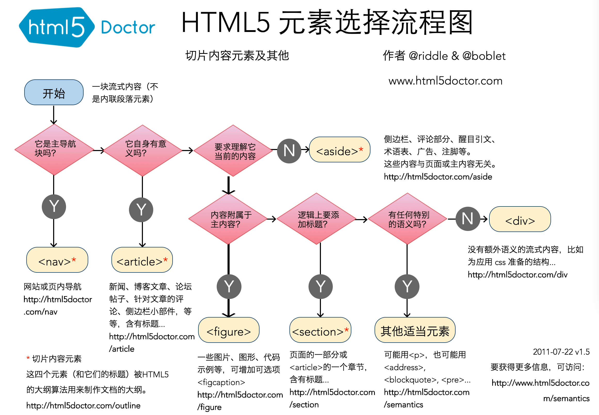

## 置换元素和非置换元素

对于 CSS 来说，元素有两种形式：置换元素和非置换元素。

置换元素：用来置换元素内容的部分不由文档内容直接表示。例如  `img`、`input`。`img`  元素本身没有内容，其内容由文档之外的图像文件替换。`input`  类似，根据类型不同，会替换成按钮、单选框、输入框等。

非置换元素：HTML 元素大部分均是非置换元素，即元素的内容由用户代理（通常是浏览器）在元素自身生成的框中显示。例如  `span`、`p`、`h1`  等。

## 元素的显示方式

CSS 还会把元素分成块级和行内两种基本类型。

> 其实不只这两种，还有其他显示类型，不过这两种是最常见的。

块级元素：默认生成一个填满父级元素内容区域的框，前后都断行。例如  `p`、`div`、列表。

行内元素：在一行文本内生成元素框，不打断所在行。例如  `a`、`span`、`strong`、`em`  等。

重要区别点：块级元素不能出现在行内元素中。

## HTML 的元素嵌套规则

HTML 元素嵌套规则是指 HTML 标签在嵌套时的合法性，即**标签嵌套的顺序和层级**

::: danger **HTML 元素的嵌套合法性**

HTML 元素嵌套**是否合法由标签的语义决定**，即标签的语义决定了标签的嵌套规则

在  `<h1>`  中不能再嵌套  `
`，因为  `
`  是一个段落，而  `<h1>`  是一个标题，段落不能嵌套在标题中
:::

## HTML5 新特性

HTML5 引入了许多新特性和改进，使得 Web 开发变得更加强大和灵活。HTML5 的新特性主要包括：

- **语义化标签**：引入新的语义化标签，如`<header>`、`<footer>`、`<article>`、`<section>`等，用于更清晰地表示文档的结构和内容
- **多媒体支持**：提供了`<audio>`和`<video>`元素
- **Canvas 画布**： 提供了  `<canvas>`  元素，允许通过 JavaScript 绘制图形、图表和动画
- **表单增强**：如  `<input>`  的  `type`  属性中的  `date`、`email`、`url`
- **本地存储**：提供了 Web Storage（localStorage 和 sessionStorage）和 IndexedDB，使得浏览器可以在客户端存储数据，以提高性能和离线应用的能力
- **地理位置 API**：提供了 Geolocation API，使得网页可以获取用户设备的地理位置信息
- **Web Workers**：允许在后台运行脚本，提高网页的性能和响应性

::: danger **HTML5 和 H5**

- HTML5 是 HTML 的第五个版本，是 HTML 的最新标准
- H5 不是一个技术名词，泛指一些富有创意、具有炫酷效果的移动端网页，其通常使用 HTML5、CSS3、JavaScript 等技术来实现丰富的交互和动画效果（这个名词常出现于以下场景） - 产品业务：我们有个需求，要做一个 H5 页面来承载 XXX - 销售宣传：给客户吹牛逼说我们的 H5 页面很炫酷
  :::

## 语义化

HTML 语义化是指根据内容的结构化（内容语义化）来选择合适的标签（代码语义化），即**用正确的标签做正确的事情**

**语义化的优点**

HTML 语义化增强文档的可识别性

- 可以使页面在没有  `CSS`  样式表的情况下也能呈现出很好的内容结构
- 有利于  `SEO`  优化（爬虫依赖 HTML 的标签来确定渲染关键字的权重）
- 方便其他设备解析（屏幕阅读器、盲人阅读器）提升了用户体验
- 增强了代码的可读性和可维护性

**常用的语义化标签**

- `<article>`：表示文章主体部分
- `<aside>`：表示跟文章主体不那么相关的部分，一般包含导航、广告等工具性质的内容
- `
 和 
`：表示可以查看或隐藏的其他详细信息
- `<figure> 和 <figcaption>`：表示与文章相关的图像、照片等流内容
- `<footer>`：通常出现在尾部，包含作者信息、相关链接、版权信息等
- `<header>`：表示导航或者介绍性的内容
- `<h1> ~ <h6>`：表示文章中不同层级的标题
- `
`：表示文章的段落
- `<main>`：表示文章的主要内容
- `<nav>`：表示导航
  - 在  `header`  中大多表示文章目录
  - 在  `aside`  中大多是关联页面或者是整站地图
- `<section>`：表示文章中的“节”或“段”
- `<time>`：表示日期或时间

HTML5 标签选择流程图

