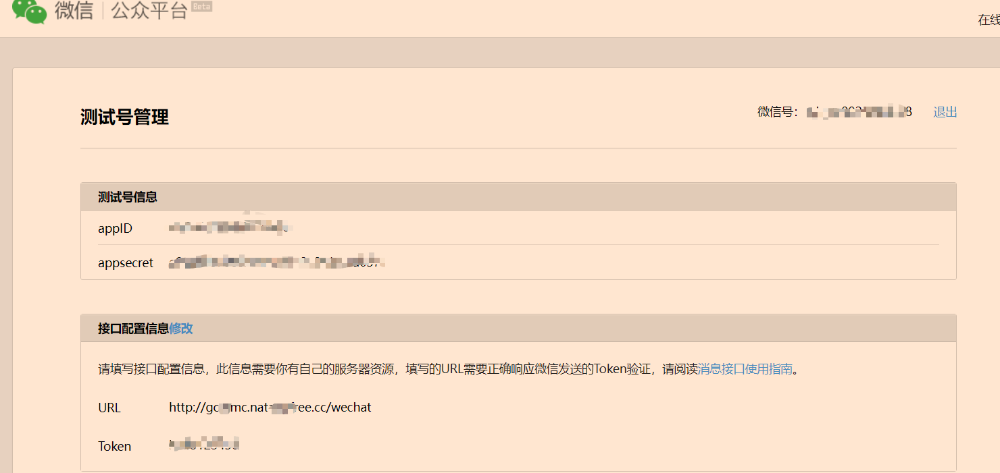

## 第一步：注册测试公众号

在网址：[微信公众平台 (qq.com)](https://mp.weixin.qq.com/debug/cgi-bin/sandbox?t=sandbox/login)，直接使用微信登录，即可获得一个用于测试的公众号。

首先需要配置【接口配置信息】，这个 URL 需要是公网能访问的地址，将有两个作用：

- 验证后端服务与微信服务的连通性（Token 验证）
- 接收处理来自微信服务器的消息

如下图：



## 第二步：本地编写后端服务

在 Controller 里编写代码：

```java
@GetMapping("/wechat")
public void validate(HttpServletRequest req, HttpServletResponse response) {
    log.info("----- 开始校验签名 -----");
    // 接收微信服务器发送请求时传递过来的参数
    String signature = req.getParameter("signature");
    String timestamp = req.getParameter("timestamp");
    String nonce = req.getParameter("nonce"); //随机数
    String echostr = req.getParameter("echostr");//随机字符串

    try (PrintWriter out = response.getWriter()) {
        // 通过检验signature对请求进行校验，若校验成功则原样返回echostr，否则接入失败
        if (WechatUtil.checkSignature(signature, timestamp, nonce)) {
            log.debug("微信加密签名:" + signature + ";时间戳:" + timestamp + ";随机数:" + nonce);
            out.print(echostr);
        }
        log.info("----- 校验成功 -----");
    } catch (IOException e) {
        log.info("-----校验签名失败-----");
        e.printStackTrace();
    }
}
```

WechatUtil 代码：

```java
import java.security.MessageDigest;
import java.security.NoSuchAlgorithmException;
import java.util.Arrays;

public class WechatUtil {
    /**
     * token可以自己进行定义，必须为英文或者是数字，长度为3-32字符，这个token要跟服务器配置中的token一致
     */
    private static final String token = "xxxx";

    /**
     * 校验签名
     *
     * @param signature 签名
     * @param timestamp 时间戳
     * @param nonce     随机数
     * @return 布尔值
     */
    public static boolean checkSignature(String signature, String timestamp, String nonce) {
        String checkText = null;
        if (null != signature) {
            //对ToKen,timestamp,nonce 按字典排序
            String[] paramArr = new String[]{token, timestamp, nonce};
            Arrays.sort(paramArr);
            //将排序后的结果拼成一个字符串
            String content = paramArr[0].concat(paramArr[1]).concat(paramArr[2]);

            try {
                MessageDigest md = MessageDigest.getInstance("SHA-1");
                //对接后的字符串进行sha1加密
                byte[] digest = md.digest(content.getBytes());
                checkText = byteToStr(digest);
            } catch (NoSuchAlgorithmException e) {
                e.printStackTrace();
            }
        }
        //将加密后的字符串与signature进行对比
        return checkText != null && checkText.equals(signature.toUpperCase());
    }

    /**
     * 将字节数组转化我16进制字符串
     *
     * @param byteArrays 字符数组
     * @return 字符串
     */
    private static String byteToStr(byte[] byteArrays) {
        StringBuilder str = new StringBuilder();
        for (byte byteArray : byteArrays) {
            str.append(byteToHexStr(byteArray));
        }
        return str.toString();
    }

    /**
     * 将字节转化为十六进制字符串
     *
     * @param myByte 字节
     * @return 字符串
     */
    private static String byteToHexStr(byte myByte) {
        char[] Digit = {'0', '1', '2', '3', '4', '5', '6', '7', '8', '9', 'A', 'B', 'C', 'D', 'E', 'F'};
        char[] tampArr = new char[2];
        tampArr[0] = Digit[(myByte >>> 4) & 0X0F];
        tampArr[1] = Digit[myByte & 0X0F];
        return new String(tampArr);
    }
}
```

## 第三步：内网穿透

使用 Natapp。

1. 官网注册、登录
2. 支付宝认证（有点坑，我第一天一直失败，说是我支付宝未实名认证。第二天一试就成功了0.0）
3. 开启自己的免费通道，配置通道的时候，指定自己后端服务的端口，比如我是 9011
4. 本地 cmd 里 `natapp -authtoken=xxxxx`这里的 xxx 即上述密钥

::: tip 💡注意
免费通道生成的那个 https 链接不是固定的，甚至你一直开着，过一阵子都给变了，贼几把扯蛋。
:::

5、复制链接到上文图中，配置到 URL 里，最后加上你后端服务的 URI，例如我的是 /wechat。点击提交，即可成功。