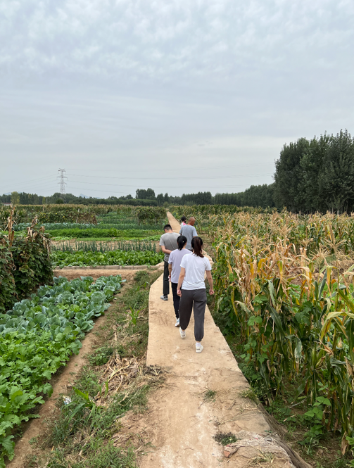
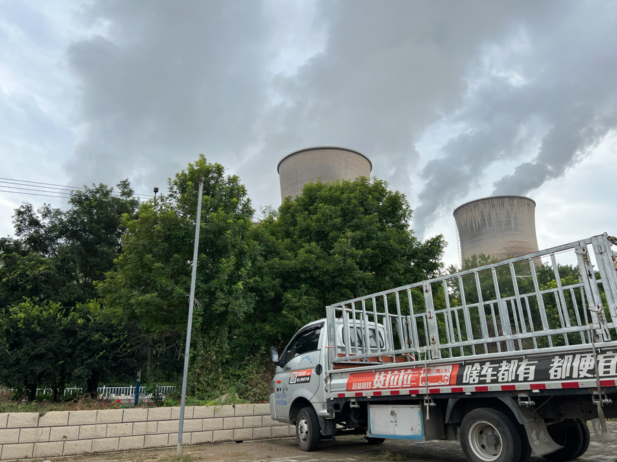
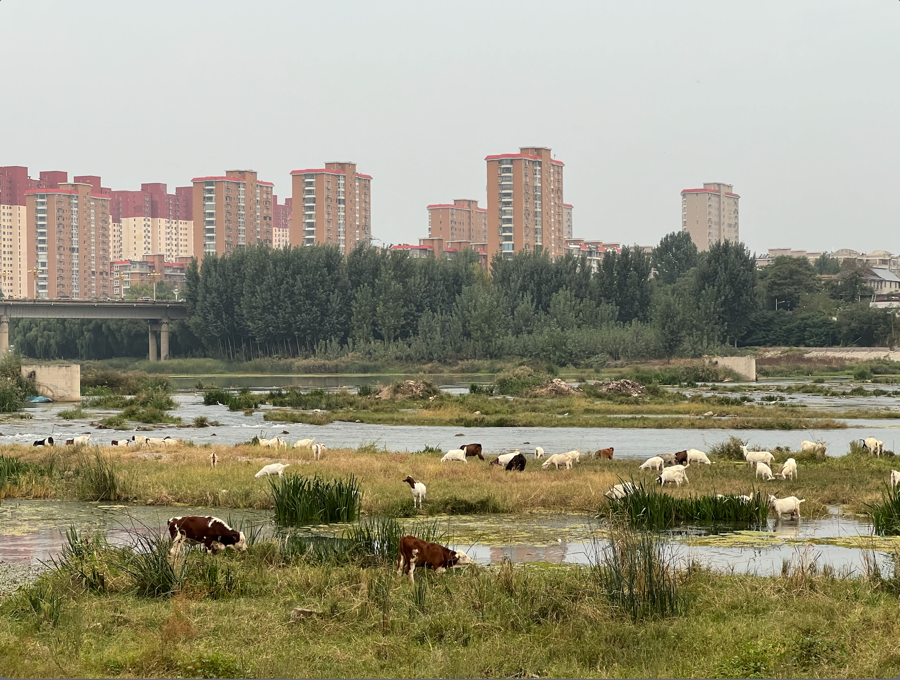

今年的中秋，终究又是掺杂进了国庆。

依旧是老样子，提前一天请假回家，没那个胆子放假当天开车回家。

## 访亲
1日，带媳妇儿回娘家。岳父岳母准备了一大桌子佳肴，这次哥哥嫂子也在。小侄女芊芊又长大了不少，比起今年五一，孩子白皙的脸蛋上
渐渐褪去婴儿的稚嫩。
饭罢，小侄女强烈要求让爷爷骑着三轮载着她去玩儿，小小的三轮载着小侄女和媳妇儿出了门。
嫂子对这我哥说：我还没去过你家地里呢，我说我也没去过，那咱们也去看看吧。三人前后踱步前往菜园子……

菜园中，众人努力辨识着不同的菜。有圆白菜、长白菜、豆角、黄豆、胡萝卜、香菜、白萝卜、菜花、大葱、花生……
除了小时候的胡萝卜苗跟香菜是真的分不清，其它大抵还是认得出来。不过，我也是头回看到我们这边竟然还有种菜花的。

后媳妇儿在娘家住了一天，次日接媳妇儿回家，返家途中，决定再去费城国际充个电。
本来这次有了准备，下高速后一直保持着保电 70% 的状态，就是为了压缩仓促中充电的时间，能待在家里的日子真得很短。
这次费城这边又多了一块儿充电的地方，快充、慢充都有，果然只有强大的国家、稳定的社会才能发展如此迅速。

充电时，跟媳妇儿再一旁侃天侃地，附一张电厂烟囱照片。

5日，去看望姥娘，年纪大了，摔了一跤，所幸状况良好，估计不出几日便可起身。
想起小时候调皮被我爹揍，爷爷奶奶护不住我，就去叫我姥娘来一起「劝架」，岁月一去不复返带走了太多东西。
临走，妗子给带了一包自家摘的核桃。

## 会友

欲买桂花同载酒，终不似，少年游。

4 日，和老朋友们约了饭局。
下午，我、毅兄与伟哥踱步冶河公园。冶河水位很低，河中多个浅滩草木旺盛，但见牛羊成群。
几只看起来勇猛异常的牧羊犬上蹿下跳赶着羊群有序前进。忽见二人闲坐河中州，好似论地谈天画棋盘……
吾三人漫步河边小道，步履或快或慢，言语或轻薄或沉重，话题也从几年前刚毕业时的高中生活吐槽变成了如今房子、车子、票子艰难……
成人之游终不似少年之游。

附上 23 年春节假期间和毅兄在同地游的记录：
《故人》会友北国早，踱步冶河东。水清鸟依游，成双入苇中。晴阳忘冬寒，灼尽台上霜。公园新面目，故人笑音容。2023.1.18 游冶河记

后，与毅兄、伟哥、毛哥、亚东于桥西胡家大厨恰饭，无人饮酒。