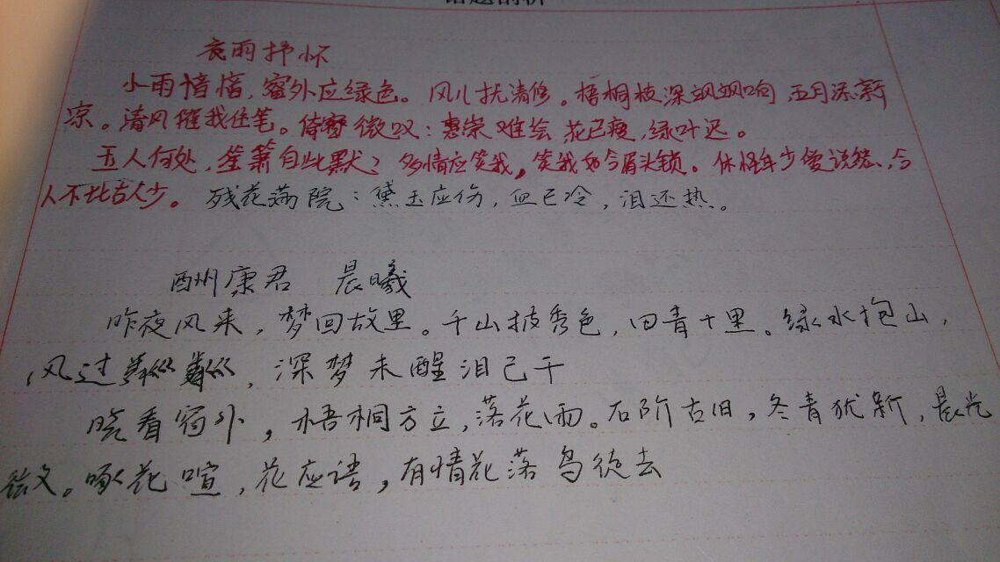

## 《中秋小记》

昨夜君入梦，起身至凉城。

叹兮今夜月，不比去年明。

2014.9.27 夜

---

## 《我伟大的平中》

> 2012年4月2日
> 平中与众不同月考在食堂，怎不叫人为之一颤，不才于历史考试闲暇之际为诗一首解小闷

考感二

璃门不遮窗外寒，春风亦拂门卷帘。

考堂食堂与偕欢，人声物声共为伴。

刚来一首神话曲，再添两声苏腔段。

七嘴八舌考场景，三心二意答试卷。

---

## 《苦言》

2012年2月7日

碌碌时光十六载， 龙门已然跃过半。

吾性本孤心自僻，热泪欲涌眉未展。

悠悠日日所历事， 几件使得吾开颜。

下笔忆记往思事，心中再过几苦言。

---

## 《夜雨舒怀 · 赠半哥》

2013.4.2

小雨yinyin，窗外应绿色。风儿扰清修。梧桐枝深飒飒响，五月添新凉。清风催我住笔。倚窗微叹：惠崇难绘，花已瘦，绿叶迟。

玉人何处，笙箫从此默。多情应笑我，笑我如今眉头锁。休怪年少爱说愁，今人不比古人少。「残花满院：黛玉应伤，血已冷，泪还热。」

**《酬康君 · 晨曦》**

半哥

昨夜风来，梦回故里。千山披秀色，回青千里。绿水抱山，风过粼粼，深梦未醒泪已干。
晓看窗外，梧桐方立，落花雨。石阶古泪，冬青犹新，晨光微，啄花喧，花应语，有情花落鸟徒去。

> 以下为原笔记：
> 
